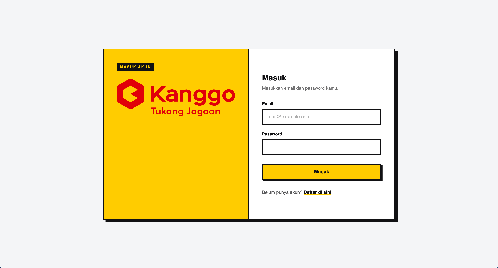
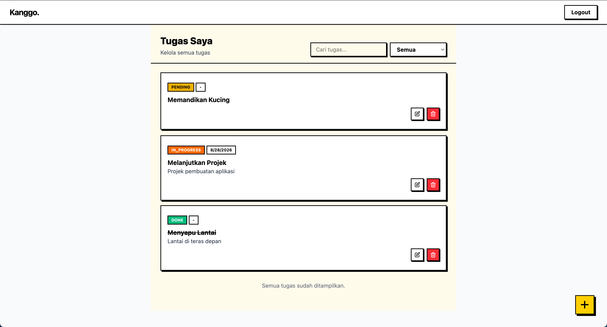

# Kanggo Task Management

Kanggo Task Management adalah aplikasi web sederhana untuk mengelola daftar tugas secara terorganisir. Pengguna dapat membuat akun, masuk, menambahkan tugas, mengubah judul,deskripsi,deadline dan status, mencari dan memfilter tugas, serta menghapus tugas yang sudah tidak diperlukan.

Aplikasi ini menggunakan Vue 3 dan Vite pada frontend, Express dengan TypeScript pada backend, Prisma sebagai ORM, dan MariaDB sebagai database. Aplikasi dapat dijalankan menggunakan Docker Compose atau secara manual. Lihat [tutorial instal](docs/install.md) untuk informasi lebih lengkap.

## Fitur utama

- Registrasi dan login pengguna
- Daftar tugas dengan status `PENDING`, `IN_PROGRESS`, dan `DONE`
- Tambah, edit, dan hapus tugas
- Deadline tugas
- Pencarian berdasarkan judul
- Filter berdasarkan status
- Pagination/infinite scroll untuk daftar tugas

## Contoh tampilan

### Halaman login

### Halaman daftar tugas

